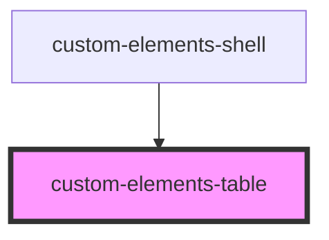

# custom-elements-table

<!-- Auto Generated Below -->

## Properties

| Property | Attribute | Description | Type       | Default     |
| -------- | --------- | ----------- | ---------- | ----------- |
| `items`  | --        |             | `Object[]` | `undefined` |

## Dependencies

### Used by

 - [custom-elements-shell](../elements-shell)

### Graph

----------------------------------------------

*Built with [StencilJS](https://stenciljs.com/)*
