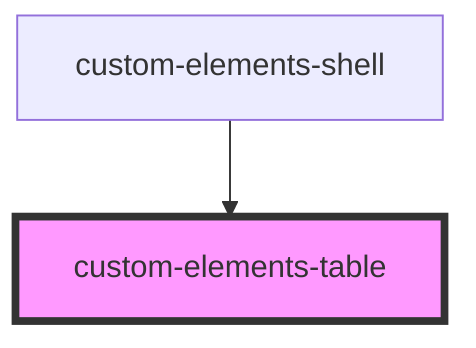

# custom-elements-table

<!-- Auto Generated Below -->

## Properties

| Property     | Attribute     | Description | Type       | Default     |
| ------------ | ------------- | ----------- | ---------- | ----------- |
| `data`       | --            |             | `Object`   | `undefined` |
| `followHref` | `follow-href` |             | `boolean`  | `undefined` |
| `items`      | --            |             | `Object[]` | `undefined` |

## Events

| Event      | Description | Type               |
| ---------- | ----------- | ------------------ |
| `navigate` |             | `CustomEvent<any>` |

## Dependencies

### Used by

 - [custom-elements-shell](../elements-shell)

### Graph

----------------------------------------------

*Built with [StencilJS](https://stenciljs.com/)*
